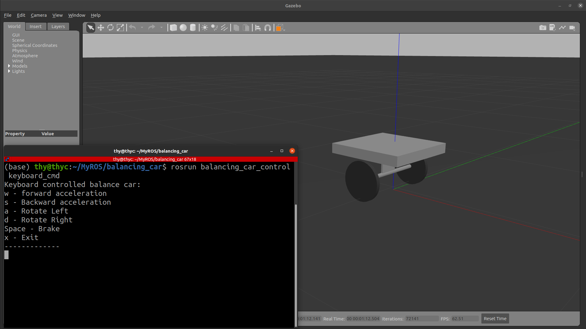
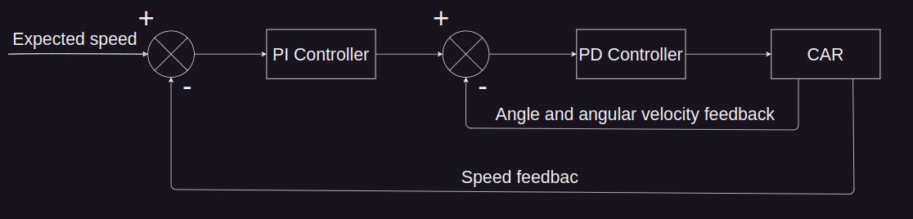
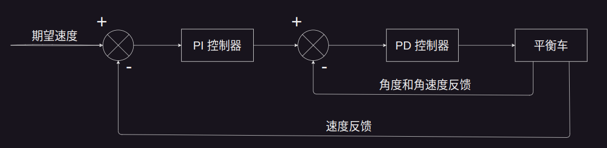

# Balancing Car Simulation in Gazebo and Ros(Noetic)

## English
### Control Principles
- Utilize the Gazebo **imu** plugin in the URDF model to acquire the balance car's orientation.
- Obtain the speed of the two wheels from the **/joint_state** topic messages, simulating motor encoders.
- Employ a cascade PID control for the speed and upright loops, illustrated in the diagram below: 
- The steering loop uses a single-level PID control.

### Package Descriptions
- **robo** includes the balance car model, controller configuration files, and launch files.
- **balancing_car_control**
  - *controller.cpp* - Contains the control algorithm.
  - *sensor.cpp* - Manages sensor perception.
  - *keyboard_cmd.cpp* - Handles keyboard motion control.

### Usage Instructions
1. Compile the project: **catkin_make**
2. Refresh the environment variables: **source devel/setup.bash**
3. Launch the main system: **roslaunch robo car.launch**
4. Run the keyboard control node: **rosrun balancing_car_control keyboard_cmd**
   | Key | Function |
   |---|---|
   |w, s|Forward and backward motion|
   |a, d|Left and right steering|  
   |Space|Stop|
   |x|Exit the node|
5. PID parameters are not optimized yet, but the system is functional.

## 中文
### 控制原理
- 在URDF模型中使用gazebo的 **imu** 插件获取平衡车姿态
- 从 **/joint_state** 话题消息获取两轮的速度，相当于电机编码器
- 速度环和直立环使用 **串级PID** 控制，框图如下：
- 转向环只使用单级PID控制

### 功能包说明
- **robo** 包含平衡车模型，控制器配置文件和launch文件
- **balancing_car_control** 
  - *controller.cpp* 控制算法部分
  - *sensor.cpp* 传感器感知部分
  - *keyboard_cmd.cpp* 键盘运动控制部分

### 使用说明
1. 编译项目： **catkin_make**
2. 刷新环境变量： **source devel/setup.bash**
3. 运行主体： **roslaunch robo car.launch**
4. 运行键盘控制节点： **rosrun balancing_car_control keyboard_cmd**
    | 按键 | 功能 |
    |---|---|
    |w,s|前后运动|
    |a,d|左右转向|  
    |空格|停车|
    |x|退出该节点|
5. PID参数还未调到最佳，但是也能用